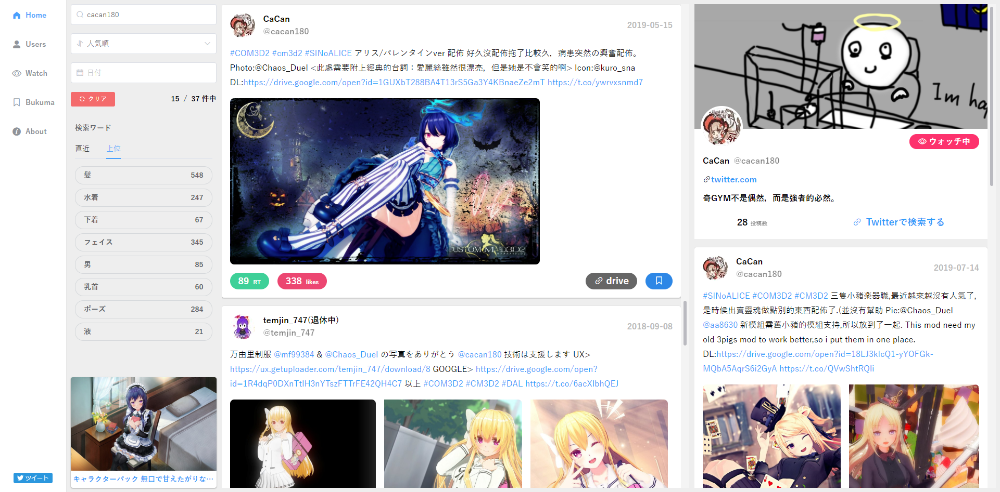

# Mukuu (β)

<div align="center">
  
  <p>Mukuu is the CUSTOM-ORDER-MAID-3D2(COM3D2) MOD Search Site.</p>
</div>

# Usage

Go to <a href="https://mukuu.herokuapp.com">https://mukuu.herokuapp.com</a>

# Requirement

- Node.js 10+
- MongoDB 3.4+

# Development

### First step

1. Clone project

```bash
git clone https://github.com/eiurur/Mukuu
cd Mukuu
```

2. Change enviroment variables.

```bash
mv packages/backend/.env.sample packages/backend/.env
vim packages/backend/.env
```

**.env**

```ini
PORT=9100
MONGODB_URI=mongodb://127.0.0.1/Mukuu
APP_NAME=Mukuu
TWITTER_CONSUMER_KEY=<YOUR_KEY> <- change here
TWITTER_CONSUMER_SECRET=<YOUR_SECRET> <- change here
TWITTER_ACCESS_TOKEN=<YOUR_TOKEN> <- change here
TWITTER_ACCESS_TOKEN_SECRET=<YOUR_TOKEN_SCRENT> <- change here
TWITTER_CALLBACK_URL=<YOUR_CAKLLBACK> <- change here
```

3. install and launch

```bash
npm install
npm run bootstrap
```

4. Go to `http://127.0.0.1:8100`

### Development Start

```
npm run dev
```

### Build

```bash
npm run build
```

### Production Start

```bash
npm run start
```
